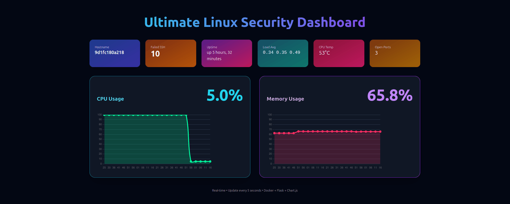

# Linux-Dashboard



**Linux-Dashboard** is a real-time Linux monitoring and security dashboard built with **Docker + Flask + Chart.js**.  
It allows you to monitor **CPU, RAM, temperature, failed SSH attempts, open ports**, and more in real-time.

## Features

- Real-time CPU and RAM usage charts
- CPU temperature and open ports
- Random failed SSH attempts for testing alerts
- Easy to run with Docker and docker-compose
- Extendable for Telegram Bot notifications

## Installation & Usage

```bash
git clone https://github.com/faridhasani95/Linux-Dashboard.git
cd Linux-Dashboard
docker-compose up --build
